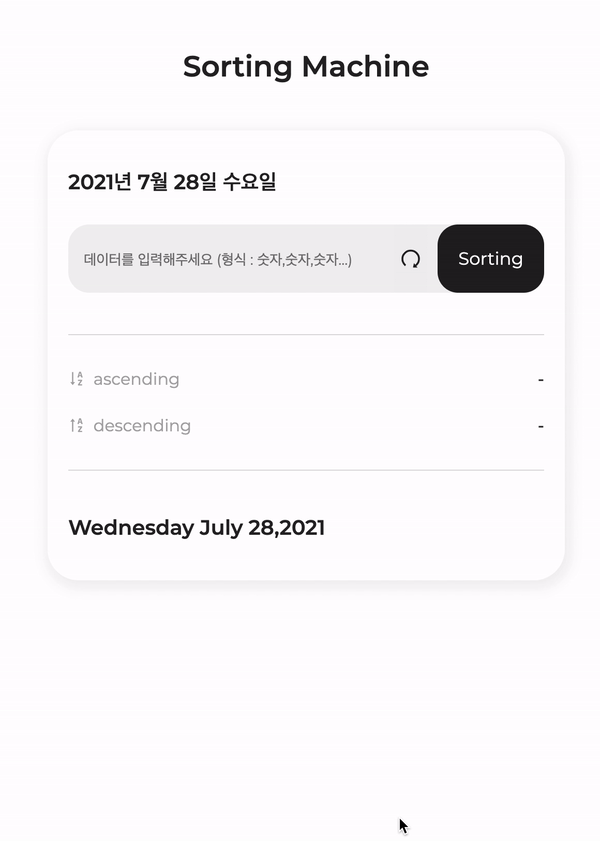

# Solar connect front-end internship test

## Sorting Machine

- 숫자를 string으로 입력받은 후 오름차순,내림차순으로 정렬하는 소팅기능을 가진 서비스

---

### condition

1. 타이머

- [1,6. 타이머]는 재활용이 가능한 Component로 구성합니다.
- [1. 타이머]는 "ko-KR" 지역시간 표기법으로 나타냅니다.(예> 2021년 7월 20일 화요일)
- [6. 타이머]는 "en-US" 지역시간 표기법으로 나타냅니다. (예> Tuesday July 20, 2021)
- 한국 표준시를 기준으로 나타냅니다.

2. 입력

- 사용자의 입력을 받습니다.
- 입력 데이터의 형식은 "숫자,숫자,숫자..." 입니다. 예> 1,3,2,4
- 잘못된 형식의 입력데이터는 예외처리하여 사용합니다.

3. 시작

- 사용자가 버튼을 누르면 소팅이 시작됩니다.
- [4. 결과 필드]에 바로 노출 되고 3초 후에 [5.결과 필드]에 결과가 노출됩니다.

4. 결과

- 결과 데이터의 형식은 "숫자, 숫자, 숫자..." 입니다. 예> 1, 2, 3, 4
- [4. 결과 필드]에서는 오름차순의 결과를 나타냅니다.
- [5. 결과 필드]에서는 내림차순의 결과를 나타냅니다.
- 알고리즘은 소팅알고리즘을 사용하지 않고, 자신이 구현 할 수 있는 정렬의 방법으로 직접 구현합니다.

5. 기타 조건

- ReactJS로 구현하세요.
- 과제를 위한 추가적인 패키지 설치는 자유입니다.
- 레이아웃은 그림을 참고하되, UI 및 UX는 작성자 편의에 맞게 구현하세요.
- 상기 조건을 제외한 모든 부분들은 작성자 편의에 맞게 구현하세요.

---

### 추가기능

- reset button

### 참고사이트

- <a href="https://regexr.com/" target="_blank">정규식 테스트</a>
- 날짜 표기 : <a href="https://day.js.org/" target="_blank">Day.js</a>
- <a href="https://developer.mozilla.org/ko/docs/Web/JavaScript/Reference/Global_Objects/Array/sort" target="_blank">자바스크립트 sort 함수</a>
